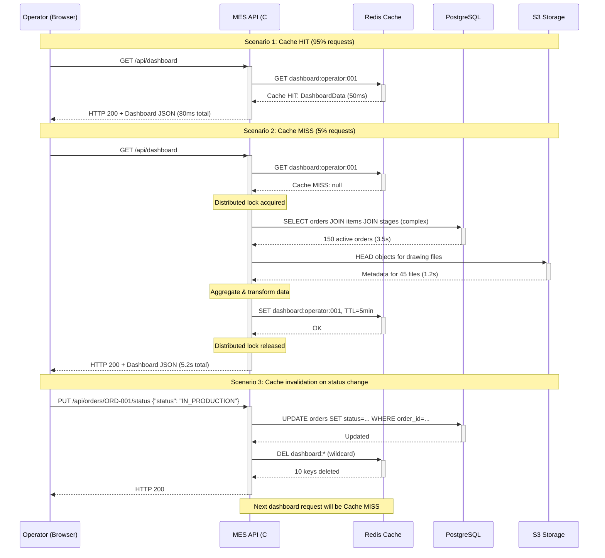
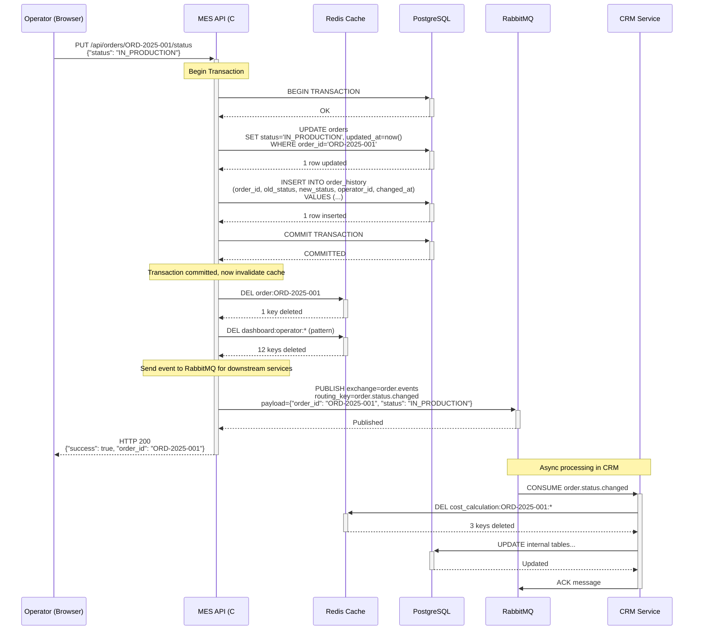
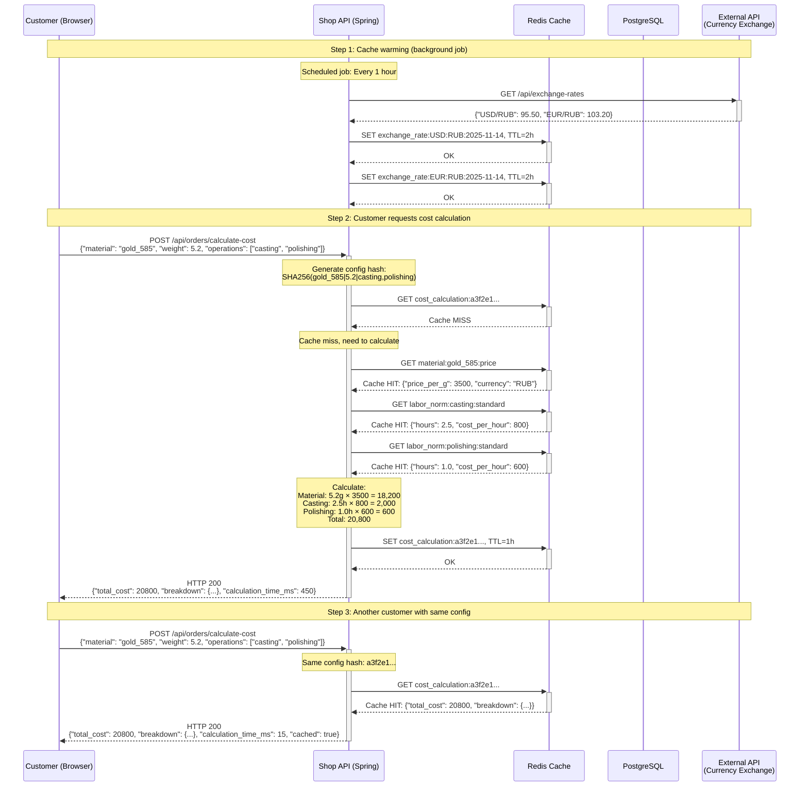

---
up:
  - "[[Task5]]"
---
# Архитектурное решение по внедрению кеширования в систему "Александрит"

## 1. Анализ системы

### 1.1 Текущая архитектура и проблемы

**Компоненты системы:**

```
┌──────────────────────────────────────────────────────────────────┐
│                      Current Architecture                        │
│                                                                  │
│  Customer ──► Shop (Vue.js + SpringBoot + PostgreSQL)            │
│                  │                                               │
│                  ├──► CRM (SpringBoot + PostgreSQL)              │
│                  │     ├── Order Processing                      │
│                  │     └── Cost Calculation (2-30 min! ❌)       │
│                  │                                               │
│                  └──► RabbitMQ ──► MES (React + C# + PostgreSQL) │
│                                         ├── Dashboard (slow! ❌) │
│                                         └── S3 (drawings)        │
└──────────────────────────────────────────────────────────────────┘
```

**Выявленные проблемы:**

1. **Медленная загрузка дашборда MES (операторы)**
   - **Причина:** каждый раз запрашиваются данные из PostgreSQL + файлы из S3
   - **Паттерн доступа:** операторы обновляют дашборд каждые 1-5 минут
   - **Данные:** список активных заказов, статусы, файлы чертежей
   - **Характеристика:** READ-heavy, данные меняются редко (обновление статусов 1-2 раза/час на заказ)

2. **Долгий расчет стоимости (2-30 минут)**
   - **Причина:** сложные расчеты с множеством параметров (материалы, курсы, трудозатраты)
   - **Паттерн доступа:** одна и та же конфигурация может запрашиваться многократно
   - **Данные:** прайсы материалов, курсы валют, нормативы трудозатрат
   - **Характеристика:** COMPUTE-heavy, промежуточные результаты повторно используемы

3. **Потеря заказов через RabbitMQ**
   - **Причина:** отказ consumers или overload
   - **Решение:** НЕ кеширование, а persistent queues + dead letter queues (out of scope)

### 1.2 Анализ доступа к данным

**Частотный анализ (на основе типичной нагрузки):**

| Операция | Частота | Latency | Изменчивость данных | Приоритет кеширования |
|----------|---------|---------|---------------------|----------------------|
| Загрузка дашборда MES | 10 RPS | 4-6s | Редкая (1 upd/час) | ⭐⭐⭐ ВЫСОКИЙ |
| Список заказов (Shop) | 5 RPS | 200ms | Средняя (1 upd/10 мин) | ⭐⭐ СРЕДНИЙ |
| Расчет стоимости | 1 RPS | 2-30 мин | Редкая (курсы 1/день) | ⭐⭐⭐ ВЫСОКИЙ |
| Прайс материалов | 20 RPS | 100ms | Редкая (1 upd/день) | ⭐⭐⭐ ВЫСОКИЙ |
| Карточка товара (Shop) | 50 RPS | 50ms | Редкая (1 upd/неделя) | ⭐⭐ СРЕДНИЙ |
| Создание заказа | 0.5 RPS | 300ms | N/A (write) | ❌ НЕ кешировать |

---

## 2. Мотивация: Что кешировать и почему

### 2.1 Критические точки для кеширования

#### 2.1.1 MES Dashboard - Список активных заказов

**Проблема:**
- Текущая latency: 4-6 секунд
- Причина: JOIN 5+ таблиц + загрузка metadata файлов из S3

**Что кешировать:**
```sql
-- Запрос без кеширования (4-6s)
SELECT
    o.order_id,
    o.order_number,
    o.status,
    o.customer_name,
    o.created_at,
    o.deadline,
    COUNT(oi.item_id) as items_count,
    SUM(oi.total_cost) as total_amount,
    ps.current_stage,
    ps.progress_percent,
    array_agg(f.s3_key) as drawing_files
FROM orders o
    JOIN order_items oi ON o.order_id = oi.order_id
    JOIN production_stages ps ON o.order_id = ps.order_id
    LEFT JOIN files f ON o.order_id = f.order_id
WHERE o.status IN ('VALIDATED', 'IN_PRODUCTION', 'QUALITY_CHECK')
GROUP BY o.order_id, ps.production_stage_id
ORDER BY o.deadline ASC
LIMIT 100;
```

**Почему кешировать:**
- ✅ **Предсказуемые данные:** список активных заказов меняется редко (1-2 обновления/час)
- ✅ **Высокая частота доступа:** 10 операторов × 12 обновлений/час = 120 запросов/час
- ✅ **Дорогой запрос:** JOIN + aggregations + S3 metadata
- ✅ **Допустимая stale data:** операторам допустимо видеть данные с задержкой 1-5 минут

**Ожидаемый результат:**
- Latency: 4-6s → **50-100ms** (из Redis)
- Database load: -90%
- UX: операторы работают без задержек

#### 2.1.2 Cost Calculation - Промежуточные результаты

**Проблема:**
- Текущая latency: 2-30 минут (!)
- Причина: пересчет стоимости материалов, трудозатрат, маржи для каждого item

**Что кешировать:**

1. **Прайс материалов:**
```java
// Key: material:{material_id}:{quality}
// Value: { price_per_gram: 3500, currency: "RUB", valid_until: "2025-11-15" }
// TTL: 24 hours
```

2. **Курсы валют:**
```java
// Key: exchange_rate:{currency_from}:{currency_to}:{date}
// Value: { rate: 95.50, source: "CBR" }
// TTL: 24 hours
```

3. **Нормативы трудозатрат:**
```java
// Key: labor_norm:{operation}:{complexity}
// Value: { hours: 2.5, cost_per_hour: 800 }
// TTL: 7 days (меняются редко)
```

4. **Полный расчет стоимости (memoization):**
```java
// Key: cost_calculation:{config_hash}
// config_hash = SHA256(material_id + weight + operations + stones + ...)
// Value: { total_cost: 25000, breakdown: {...} }
// TTL: 1 hour
```

**Почему кешировать:**
- ✅ **Повторяющиеся конфигурации:** 30% запросов - это повторные расчеты аналогичных изделий
- ✅ **Дорогой compute:** 2-30 минут CPU времени
- ✅ **Редко меняющиеся справочники:** курсы/прайсы обновляются 1 раз/день
- ✅ **Допустимая stale data:** клиент согласен на расчет с курсом "на начало дня"

**Ожидаемый результат:**
- Cache hit rate: 30-40%
- Latency при cache hit: 2-30 мин → **< 1 секунда**
- Latency при cache miss: без изменений, но результат кешируется
- Database load: -60%

#### 2.1.3 Catalog - Карточки товаров

**Проблема:**
- Текущая latency: 50-100ms
- Высокая частота запросов: 50 RPS в пиковые часы

**Что кешировать:**
```java
// Key: product:{product_id}
// Value: { name: "Кольцо золотое", price: 5000, images: [...], description: "..." }
// TTL: 1 hour
```

**Почему кешировать:**
- ✅ **Редко меняющиеся данные:** обновление карточек 1 раз/неделю
- ✅ **Высокая частота доступа:** 50 RPS
- ✅ **Read-heavy:** 99% операций - чтение

**Ожидаемый результат:**
- Latency: 50ms → **5ms**
- Database load: -80%
- Возможность масштабирования Shop без увеличения DB capacity

### 2.2 Что НЕ кешировать

| Операция | Почему НЕ кешировать |
|----------|----------------------|
| Создание заказа | Write operation, нет смысла кешировать |
| Изменение статуса заказа | Write operation + требуется немедленная консистентность |
| Личные данные клиента | GDPR compliance - чувствительные данные |
| Финансовые транзакции | Требуется strong consistency |
| Real-time инвентарь | Критична актуальность (race conditions) |

---

## 3. Предлагаемое решение

### 3.1 Архитектурный стек

**Комбинированный подход:**

```
┌──────────────────────────────────────────────────────────────┐
│                   Client-Side Caching                        │
│  ┌─────────────┐           ┌─────────────┐                   │
│  │   Browser   │           │    Nginx    │                   │
│  │ (LocalStore)│           │ (HTTP Cache)│                   │
│  └──────┬──────┘           └──────┬──────┘                   │
└─────────┼─────────────────────────┼──────────────────────────┘
          │                         │
          ▼                         ▼
┌──────────────────────────────────────────────────────────────┐
│                   Server-Side Caching                        │
│  ┌─────────────────────────────────────────────────────┐     │
│  │             Application Cache (Redis)               │     │
│  │  - Distributed cache                                │     │
│  │  - High availability (Sentinel/Cluster)             │     │
│  │  - Persistence (AOF)                                │     │
│  └────────┬──────────────────────┬─────────────────────┘     │
│           │                      │                           │
│           ▼                      ▼                           │
│  ┌────────────────┐     ┌────────────────┐                   │
│  │  SpringBoot    │     │    C# .NET     │                   │
│  │  (Shop, CRM)   │     │     (MES)      │                   │
│  └────────┬───────┘     └────────┬───────┘                   │
└───────────┼──────────────────────┼───────────────────────────┘
            │                      │
            ▼                      ▼
   ┌────────────────────────────────────┐
   │         Data Sources               │
   │  - PostgreSQL                      │
   │  - S3                              │
   └────────────────────────────────────┘
```

**Компоненты:**

1. **Client-Side:**
   - Browser LocalStorage для статических данных (каталог)
   - HTTP Cache (Nginx, CloudFront CDN) для статики и API responses

2. **Server-Side:**
   - **Redis** как distributed cache (in-memory key-value store)
   - Интеграция с Spring Cache (Shop, CRM)
   - Интеграция с .NET StackExchange.Redis (MES)

### 3.2 Паттерны кеширования

#### 3.2.1 Cache-Aside (Lazy Loading) - ОСНОВНОЙ

**Применение:** MES Dashboard, Catalog, Material Prices

**Workflow:**

```
┌──────────┐                  ┌──────────┐                ┌──────────┐
│Application│                 │  Redis   │                │PostgreSQL│
└─────┬────┘                  └────┬─────┘                └────┬─────┘
      │                            │                           │
      │ 1. GET dashboard           │                           │
      │───────────────────────────►│                           │
      │                            │                           │
      │ 2. Cache MISS              │                           │
      │◄───────────────────────────│                           │
      │                            │                           │
      │ 3. SELECT * FROM orders... │                           │
      │───────────────────────────────────────────────────────►│
      │                            │                           │
      │ 4. Result (4-6s)           │                           │
      │◄───────────────────────────────────────────────────────│
      │                            │                           │
      │ 5. SET dashboard, TTL=5min │                           │
      │───────────────────────────►│                           │
      │                            │                           │
      │ 6. Return to client        │                           │
      │                            │                           │
      │ ... next request ...       │                           │
      │                            │                           │
      │ 7. GET dashboard           │                           │
      │───────────────────────────►│                           │
      │                            │                           │
      │ 8. Cache HIT (50ms)        │                           │
      │◄───────────────────────────│                           │
```

**Код (Spring Boot):**

```java
@Service
public class DashboardService {

    @Autowired
    private RedisTemplate<String, DashboardData> redisTemplate;

    @Autowired
    private OrderRepository orderRepository;

    public DashboardData getDashboard(String userId) {
        String cacheKey = "dashboard:operator:" + userId;

        // 1. Try to get from cache
        DashboardData cached = redisTemplate.opsForValue().get(cacheKey);
        if (cached != null) {
            log.info("Cache HIT: {}", cacheKey);
            return cached;
        }

        // 2. Cache MISS - fetch from database
        log.info("Cache MISS: {}", cacheKey);
        DashboardData data = orderRepository.getDashboardData();

        // 3. Store in cache with TTL
        redisTemplate.opsForValue().set(cacheKey, data, 5, TimeUnit.MINUTES);

        return data;
    }
}
```

**Плюсы:**
- ✅ Простая реализация
- ✅ Кеш заполняется только для реально запрашиваемых данных
- ✅ Отказоустойчивость: при падении Redis приложение работает (медленнее)

**Минусы:**
- ❌ Первый запрос всегда медленный (cache miss penalty)
- ❌ Риск cache stampede (N запросов одновременно при cache miss)

**Митигация cache stampede:**

```java
public DashboardData getDashboard(String userId) {
    String cacheKey = "dashboard:operator:" + userId;
    String lockKey = "lock:" + cacheKey;

    DashboardData cached = redisTemplate.opsForValue().get(cacheKey);
    if (cached != null) {
        return cached;
    }

    // Distributed lock для предотвращения одновременного обращения к DB
    Boolean lockAcquired = redisTemplate.opsForValue()
        .setIfAbsent(lockKey, "1", 10, TimeUnit.SECONDS);

    if (Boolean.TRUE.equals(lockAcquired)) {
        try {
            // Double-check: может другой thread уже загрузил
            cached = redisTemplate.opsForValue().get(cacheKey);
            if (cached != null) {
                return cached;
            }

            // Загружаем из DB
            DashboardData data = orderRepository.getDashboardData();
            redisTemplate.opsForValue().set(cacheKey, data, 5, TimeUnit.MINUTES);
            return data;
        } finally {
            redisTemplate.delete(lockKey);
        }
    } else {
        // Ждем пока другой thread загрузит данные
        Thread.sleep(100);
        return getDashboard(userId);  // Retry
    }
}
```

#### 3.2.2 Write-Through - Для критичных данных

**Применение:** Изменение статуса заказа (требуется немедленная видимость в MES)

**Workflow:**

```
┌───────────┐                  ┌──────────┐                ┌──────────┐
│Application│                  │  Redis   │                │PostgreSQL│
└──────┬────┘                  └────┬─────┘                └────┬─────┘
       │                            │                           │
       │ 1. UPDATE order status     │                           │
       │───────────────────────────────────────────────────────►│
       │                            │                           │
       │ 2. DB updated              │                           │
       │◄───────────────────────────────────────────────────────│
       │                            │                           │
       │ 3. SET cache (invalidate)  │                           │
       │───────────────────────────►│                           │
       │                            │                           │
       │ 4. Success                 │                           │
```

**Код:**

```java
@Transactional
public void updateOrderStatus(String orderId, OrderStatus newStatus) {
    // 1. Update database
    Order order = orderRepository.findById(orderId)
        .orElseThrow(() -> new OrderNotFoundException(orderId));
    order.setStatus(newStatus);
    orderRepository.save(order);

    // 2. Invalidate cache для всех связанных ключей
    String orderCacheKey = "order:" + orderId;
    String dashboardCacheKey = "dashboard:*";  // Wildcard delete

    redisTemplate.delete(orderCacheKey);

    // Invalidate all dashboard caches
    Set<String> dashboardKeys = redisTemplate.keys(dashboardCacheKey);
    if (dashboardKeys != null && !dashboardKeys.isEmpty()) {
        redisTemplate.delete(dashboardKeys);
    }

    log.info("Cache invalidated: order={}, dashboard_keys={}",
        orderId, dashboardKeys.size());
}
```

**Плюсы:**
- ✅ Гарантия консистентности cache и DB
- ✅ Немедленная видимость изменений

**Минусы:**
- ❌ Увеличенная latency записи (DB + Redis)
- ❌ Усложнение транзакционной логики

#### 3.2.3 Refresh-Ahead - Для предсказуемых данных

**Применение:** Прайсы материалов, курсы валют (обновляются по расписанию)

**Workflow:**

```
┌──────────────┐              ┌──────────┐               ┌──────────┐
│Scheduled Job │              │  Redis   │               │External  │
│              │              │          │               │API (CBR) │
└──────┬───────┘              └────┬─────┘               └────┬─────┘
       │                           │                          │
       │ Every 1 hour              │                          │
       │                           │                          │
       │ 1. Fetch exchange rates   │                          │
       │─────────────────────────────────────────────────────►│
       │                           │                          │
       │ 2. Rates data             │                          │
       │◄─────────────────────────────────────────────────────│
       │                           │                          │
       │ 3. SET cache, TTL=2h      │                          │
       │──────────────────────────►│                          │
       │                           │                          │
       │ ... Application request ...│                         │
       │                           │                          │
       │                           │ GET exchange_rate        │
       │                           │◄─────────────────────────│
       │                           │                          │
       │                           │ Cache HIT (always!)      │
       │                           │─────────────────────────►
```

**Код:**

```java
@Component
public class CacheWarmer {

    @Autowired
    private RedisTemplate<String, ExchangeRate> redisTemplate;

    @Autowired
    private ExternalApiClient apiClient;

    // Каждый час обновляем курсы валют
    @Scheduled(fixedRate = 3600000)  // 1 hour
    public void warmExchangeRateCache() {
        log.info("Starting exchange rate cache warming...");

        List<ExchangeRate> rates = apiClient.fetchExchangeRates();

        for (ExchangeRate rate : rates) {
            String key = String.format("exchange_rate:%s:%s:%s",
                rate.getCurrencyFrom(),
                rate.getCurrencyTo(),
                LocalDate.now().toString()
            );

            redisTemplate.opsForValue().set(key, rate, 2, TimeUnit.HOURS);
        }

        log.info("Exchange rate cache warmed: {} rates", rates.size());
    }

    // При старте приложения
    @EventListener(ApplicationReadyEvent.class)
    public void warmCacheOnStartup() {
        warmExchangeRateCache();
        warmMaterialPricesCache();
        warmLaborNormsCache();
    }
}
```

**Плюсы:**
- ✅ Всегда cache HIT (0 latency penalty)
- ✅ Предсказуемая нагрузка на source of truth
- ✅ Можно обновлять в off-peak hours

**Минусы:**
- ❌ Потенциально stale data (до 1 часа)
- ❌ Дополнительная сложность (scheduled jobs)

### 3.3 Конфигурация Redis

**Deployment: Redis Sentinel (High Availability)**

```yaml
# docker-compose.yml
version: '3.8'

services:
  redis-master:
    image: redis:7.2-alpine
    command: redis-server /etc/redis/redis.conf
    volumes:
      - ./redis-master.conf:/etc/redis/redis.conf
      - redis-master-data:/data
    ports:
      - "6379:6379"

  redis-replica-1:
    image: redis:7.2-alpine
    command: redis-server /etc/redis/redis.conf --replicaof redis-master 6379
    volumes:
      - ./redis-replica.conf:/etc/redis/redis.conf
      - redis-replica-1-data:/data

  redis-replica-2:
    image: redis:7.2-alpine
    command: redis-server /etc/redis/redis.conf --replicaof redis-master 6379
    volumes:
      - ./redis-replica.conf:/etc/redis/redis.conf
      - redis-replica-2-data:/data

  redis-sentinel-1:
    image: redis:7.2-alpine
    command: redis-sentinel /etc/redis/sentinel.conf
    volumes:
      - ./sentinel.conf:/etc/redis/sentinel.conf

  redis-sentinel-2:
    image: redis:7.2-alpine
    command: redis-sentinel /etc/redis/sentinel.conf
    volumes:
      - ./sentinel.conf:/etc/redis/sentinel.conf

  redis-sentinel-3:
    image: redis:7.2-alpine
    command: redis-sentinel /etc/redis/sentinel.conf
    volumes:
      - ./sentinel.conf:/etc/redis/sentinel.conf

volumes:
  redis-master-data:
  redis-replica-1-data:
  redis-replica-2-data:
```

**redis.conf:**

```conf
# Persistence (AOF для durability)
appendonly yes
appendfsync everysec
auto-aof-rewrite-percentage 100
auto-aof-rewrite-min-size 64mb

# Memory management
maxmemory 2gb
maxmemory-policy allkeys-lru  # Evict least recently used keys

# Performance
timeout 300
tcp-keepalive 60
```

**sentinel.conf:**

```conf
sentinel monitor alexandrite-redis redis-master 6379 2
sentinel down-after-milliseconds alexandrite-redis 5000
sentinel parallel-syncs alexandrite-redis 1
sentinel failover-timeout alexandrite-redis 10000
```

**Spring Boot configuration:**

```yaml
# application.yml
spring:
  redis:
    sentinel:
      master: alexandrite-redis
      nodes:
        - redis-sentinel-1:26379
        - redis-sentinel-2:26379
        - redis-sentinel-3:26379
    lettuce:
      pool:
        max-active: 20
        max-idle: 10
        min-idle: 5
    timeout: 2000ms

  cache:
    type: redis
    redis:
      time-to-live: 300000  # 5 minutes default
```

---

## 4. Диаграмма последовательности (Sequence Diagram)

### 4.1 Чтение списка заказов (MES Dashboard)



### 4.2 Изменение статуса заказа (с инвалидацией кеша)



### 4.3 Расчет стоимости с кешированием (Cost Calculation)



---

## 5. Стратегия инвалидации кеша

### 5.1 Триггеры инвалидации

| Событие | Инвалидируемые ключи | Метод | Обоснование |
|---------|---------------------|-------|-------------|
| Изменение статуса заказа | `order:{order_id}`<br/>`dashboard:*` | DEL | Немедленная видимость в MES |
| Создание нового заказа | `dashboard:*`<br/>`order_list:*` | DEL | Новый заказ должен появиться в списке |
| Обновление прайса материала | `material:{material_id}:*`<br/>`cost_calculation:*` | DEL | Все расчеты стоимости стали неактуальны |
| Обновление карточки товара | `product:{product_id}` | DEL | Клиенты должны видеть актуальную информацию |
| Загрузка нового файла в S3 | `order:{order_id}:files` | DEL | Файл должен быть доступен операторам |

### 5.2 Методы инвалидации

#### 5.2.1 Time-based (TTL) - ОСНОВНОЙ

**Применение:** Все кеши имеют TTL для автоматической инвалидации

```java
// Short TTL для часто меняющихся данных
redisTemplate.opsForValue().set("dashboard:operator:001", data, 5, TimeUnit.MINUTES);

// Medium TTL для умеренно меняющихся данных
redisTemplate.opsForValue().set("product:123", product, 1, TimeUnit.HOURS);

// Long TTL для редко меняющихся данных
redisTemplate.opsForValue().set("labor_norm:casting", norm, 7, TimeUnit.DAYS);
```

**Плюсы:**
- ✅ Автоматическая защита от stale data
- ✅ Простая реализация
- ✅ Не требует сложной логики синхронизации

**Минусы:**
- ❌ Возможна stale data до истечения TTL
- ❌ Потенциальные cache misses после истечения TTL

#### 5.2.2 Event-based (Active Invalidation)

**Применение:** Критичные обновления (статус заказа, финансовые данные)

```java
@Transactional
public void updateOrderStatus(String orderId, OrderStatus newStatus) {
    // 1. Update database
    orderRepository.updateStatus(orderId, newStatus);

    // 2. Publish event to RabbitMQ
    OrderStatusChangedEvent event = new OrderStatusChangedEvent(orderId, newStatus);
    rabbitTemplate.convertAndSend("order.events", "order.status.changed", event);

    // 3. Invalidate local cache immediately
    invalidateCacheForOrder(orderId);
}

private void invalidateCacheForOrder(String orderId) {
    redisTemplate.delete("order:" + orderId);

    // Invalidate all dashboard caches (across all operators)
    Set<String> dashboardKeys = redisTemplate.keys("dashboard:*");
    if (dashboardKeys != null) {
        redisTemplate.delete(dashboardKeys);
    }
}

// В других сервисах (MES, CRM)
@RabbitListener(queues = "order.status.changed")
public void handleOrderStatusChanged(OrderStatusChangedEvent event) {
    String orderId = event.getOrderId();

    // Invalidate local cache
    redisTemplate.delete("order:" + orderId);
    redisTemplate.delete("cost_calculation:" + orderId + ":*");

    log.info("Cache invalidated for order: {}", orderId);
}
```

**Плюсы:**
- ✅ Немедленная консистентность между сервисами
- ✅ Нет stale data после обновления

**Минусы:**
- ❌ Усложнение архитектуры (event-driven)
- ❌ Зависимость от RabbitMQ availability

#### 5.2.3 Version-based (Cache Versioning)

**Применение:** Постепенная миграция кеша при breaking changes

```java
public class CacheKeyGenerator {
    private static final String CACHE_VERSION = "v2";

    public static String generateProductKey(String productId) {
        return String.format("product:%s:%s", CACHE_VERSION, productId);
    }

    public static String generateDashboardKey(String operatorId) {
        return String.format("dashboard:%s:%s", CACHE_VERSION, operatorId);
    }
}

// При изменении формата данных - просто меняем версию
private static final String CACHE_VERSION = "v3";  // Старые v2 ключи автоматически устаревают
```

**Плюсы:**
- ✅ Безопасный rollout изменений формата данных
- ✅ Можно откатиться на старую версию без потери кеша

**Минусы:**
- ❌ Дополнительная память (старые и новые версии одновременно)
- ❌ Требуется manual cleanup старых версий

### 5.3 Обработка cache stampede

**Проблема:** При истечении TTL популярного ключа N запросов одновременно идут в DB

**Решение 1: Distributed Lock**

```java
public DashboardData getDashboardWithLock(String operatorId) {
    String cacheKey = "dashboard:operator:" + operatorId;
    String lockKey = "lock:" + cacheKey;

    // Try cache first
    DashboardData cached = redisTemplate.opsForValue().get(cacheKey);
    if (cached != null) {
        return cached;
    }

    // Acquire distributed lock
    Boolean lockAcquired = redisTemplate.opsForValue()
        .setIfAbsent(lockKey, "1", 10, TimeUnit.SECONDS);

    if (Boolean.TRUE.equals(lockAcquired)) {
        try {
            // Double-check pattern
            cached = redisTemplate.opsForValue().get(cacheKey);
            if (cached != null) {
                return cached;
            }

            // Load from DB
            DashboardData data = loadFromDatabase();

            // Save to cache
            redisTemplate.opsForValue().set(cacheKey, data, 5, TimeUnit.MINUTES);

            return data;
        } finally {
            redisTemplate.delete(lockKey);
        }
    } else {
        // Lock not acquired, wait and retry
        try {
            Thread.sleep(100);
        } catch (InterruptedException e) {
            Thread.currentThread().interrupt();
        }
        return getDashboardWithLock(operatorId);  // Retry
    }
}
```

**Решение 2: Probabilistic Early Expiration**

```java
public DashboardData getDashboardWithEarlyExpiration(String operatorId) {
    String cacheKey = "dashboard:operator:" + operatorId;

    CachedValue<DashboardData> cached = redisTemplate.opsForValue().get(cacheKey);

    if (cached != null) {
        long ttl = redisTemplate.getExpire(cacheKey, TimeUnit.SECONDS);
        long now = System.currentTimeMillis() / 1000;

        // Probabilistic early expiration: вероятность refresh растет при приближении к expiry
        double probability = 1.0 - (double) ttl / 300.0;  // 300s = 5 min TTL

        if (Math.random() < probability) {
            // Async refresh
            CompletableFuture.runAsync(() -> {
                DashboardData fresh = loadFromDatabase();
                redisTemplate.opsForValue().set(cacheKey, fresh, 5, TimeUnit.MINUTES);
            });
        }

        return cached.getData();
    }

    // Cache miss - load synchronously
    DashboardData data = loadFromDatabase();
    redisTemplate.opsForValue().set(cacheKey, data, 5, TimeUnit.MINUTES);
    return data;
}
```

---

## 6. Дополнительно: Несколько вариантов решения с таблицей сравнения

### 6.1 Варианты реализации кеширования

#### Вариант 1: Redis (in-memory key-value store) - РЕКОМЕНДУЕМЫЙ

**Архитектура:**
```
Application → Redis Sentinel → Redis Master/Replicas
```

**Плюсы:**
- ✅ Очень низкая latency (< 1ms для GET)
- ✅ Богатый набор data structures (String, Hash, List, Set, Sorted Set)
- ✅ Pub/Sub для cache invalidation
- ✅ Lua scripting для атомарных операций
- ✅ Высокая доступность (Sentinel/Cluster)
- ✅ Persistence (RDB + AOF)

**Минусы:**
- ❌ Ограничение по памяти (все данные in-memory)
- ❌ Eviction при нехватке памяти (если не настроить правильно)

**Стоимость:**
- Self-hosted: 2 × AWS r6g.large (16GB RAM) = $200/месяц
- Managed (AWS ElastiCache): $250/месяц

#### Вариант 2: Memcached

**Архитектура:**
```
Application → Memcached Pool (consistent hashing)
```

**Плюсы:**
- ✅ Простая архитектура
- ✅ Отличная производительность для простых key-value
- ✅ Multi-threaded (лучше использует многоядерные CPU)

**Минусы:**
- ❌ Только key-value (нет rich data structures)
- ❌ Нет persistence (полная потеря при restart)
- ❌ Нет встроенной репликации
- ❌ Нет Pub/Sub для invalidation

**Стоимость:**
- Self-hosted: аналогично Redis
- Managed (AWS ElastiCache): $180/месяц

#### Вариант 3: Hazelcast (Distributed In-Memory Data Grid)

**Архитектура:**
```
Application (embedded Hazelcast) ⟷ Hazelcast Cluster
```

**Плюсы:**
- ✅ Embedded mode (кеш внутри приложения, без network hop)
- ✅ Автоматическая репликация и партиционирование
- ✅ Near cache для еще более низкой latency
- ✅ Distributed collections (Map, Queue, List)
- ✅ Strong consistency опции

**Минусы:**
- ❌ Высокое потребление памяти на каждом application node
- ❌ Сложная конфигурация для production
- ❌ JVM garbage collection pauses

**Стоимость:**
- Open source: free
- Enterprise: $20K+/год

#### Вариант 4: Caffeine (Local Cache) + Redis (Distributed)

**Архитектура:**
```
Application → Caffeine (L1) → Redis (L2) → Database
```

**Плюсы:**
- ✅ Двухуровневое кеширование
- ✅ Минимальная latency для L1 cache (in-process)
- ✅ Консистентность между инстансами через L2
- ✅ Caffeine - лучший Java local cache (Window TinyLFU eviction)

**Минусы:**
- ❌ Усложнение логики (2 уровня)
- ❌ Потенциальная stale data в L1 при invalidation
- ❌ Дополнительная память на каждом application node

**Стоимость:**
- Caffeine: free
- Redis: $200/месяц

#### Вариант 5: PostgreSQL + Materialized Views (без отдельного кеша)

**Архитектура:**
```
Application → PostgreSQL (Materialized Views) → Base Tables
```

**Плюсы:**
- ✅ Нет дополнительной инфраструктуры
- ✅ ACID гарантии
- ✅ Удобство разработки (обычный SQL)

**Минусы:**
- ❌ Latency значительно выше (50-200ms vs < 1ms для Redis)
- ❌ Refresh materialized views требует manual trigger или cron
- ❌ Блокировки при concurrent refresh
- ❌ Не масштабируется горизонтально

**Стоимость:**
- Та же PostgreSQL инстанция: $0 дополнительно

### 6.2 Сравнительная таблица

| Критерий | Redis (Рек.) | Memcached | Hazelcast | Caffeine+Redis | PostgreSQL MV |
|----------|--------------|-----------|-----------|----------------|---------------|
| **Latency (p99)** | < 1ms | < 1ms | < 0.5ms (near cache) | L1: < 0.1ms<br/>L2: < 1ms | 50-200ms |
| **Throughput** | 100K ops/s/node | 150K ops/s/node | 200K ops/s | L1: 1M ops/s<br/>L2: 100K ops/s | 10K ops/s |
| **Persistence** | ✅ RDB + AOF | ❌ | ✅ Configurable | L1: ❌<br/>L2: ✅ | ✅ Native |
| **High Availability** | ✅ Sentinel/Cluster | ❌ Manual | ✅ Auto | L2: ✅ | ✅ Replication |
| **Data Structures** | ✅ Rich | ❌ Key-value only | ✅ Rich | L1: ✅<br/>L2: ✅ | ❌ Tables only |
| **Cache Invalidation** | ✅ Pub/Sub | ❌ Manual | ✅ Event bus | ✅ Pub/Sub | ⚠️ Manual refresh |
| **Memory Efficiency** | ⭐⭐⭐⭐ | ⭐⭐⭐⭐⭐ | ⭐⭐⭐ | ⭐⭐⭐ | ⭐⭐⭐ |
| **Ease of Ops** | ⭐⭐⭐⭐ | ⭐⭐⭐⭐⭐ | ⭐⭐⭐ | ⭐⭐⭐ | ⭐⭐⭐⭐⭐ |
| **Community/Ecosystem** | ⭐⭐⭐⭐⭐ | ⭐⭐⭐⭐ | ⭐⭐⭐ | ⭐⭐⭐⭐ | ⭐⭐⭐⭐⭐ |
| **Стоимость (self-hosted)** | $200/мо | $180/мо | Free | $200/мо | $0 |
| **Стоимость (managed)** | $250/мо | $180/мо | $20K+/год | $250/мо | Included |
| **Use case fit** | ⭐⭐⭐⭐⭐ | ⭐⭐⭐⭐ | ⭐⭐⭐ | ⭐⭐⭐⭐ | ⭐⭐ |

### 6.3 Рекомендация для "Александрит"

**Выбор: Вариант 1 - Redis (Sentinel для HA)**

**Обоснование:**

1. **Latency:** < 1ms достаточно для всех use cases (MES dashboard, cost calculation)
2. **Reliability:** Sentinel обеспечивает automatic failover при отказе master
3. **Features:** Rich data structures (Hash для complex objects, Sorted Set для time-series)
4. **Persistence:** AOF гарантирует durability для критичных кешей
5. **Ecosystem:** Отличная интеграция с Spring Boot и .NET
6. **Cost:** $200-250/месяц - разумная стоимость для ROI

**Roadmap внедрения:**

**Phase 1 (2 недели):**
- Деплой Redis Sentinel (1 master + 2 replicas)
- Интеграция MES Dashboard (Cache-Aside pattern)
- Метрики: cache hit rate, latency reduction

**Phase 2 (2 недели):**
- Интеграция Cost Calculation (Cache-Aside + Refresh-Ahead для справочников)
- Event-based invalidation через RabbitMQ

**Phase 3 (1 неделя):**
- Cache warming jobs (exchange rates, material prices)
- Monitoring & alerting (cache hit rate < 80%, Redis memory > 90%)

**Phase 4 (ongoing):**
- Fine-tuning TTL values
- Optimization eviction policy
- Multi-level caching (Caffeine + Redis) для hot data

---

## 7. Мониторинг и метрики

### 7.1 Ключевые метрики

```yaml
# Prometheus metrics
- cache_hit_rate: (hits / (hits + misses)) > 0.80
- cache_latency_p99: < 5ms
- redis_memory_usage: < 90%
- evicted_keys_per_sec: < 10
- expired_keys_per_sec: normal traffic pattern
- connections_active: < max_connections * 0.8
```

### 7.2 Grafana Dashboard

```json
{
  "title": "Redis Cache Performance",
  "panels": [
    {
      "title": "Cache Hit Rate",
      "targets": [
        {
          "expr": "rate(redis_keyspace_hits_total[5m]) / (rate(redis_keyspace_hits_total[5m]) + rate(redis_keyspace_misses_total[5m]))"
        }
      ],
      "thresholds": [
        { "value": 0.8, "color": "green" },
        { "value": 0.5, "color": "yellow" },
        { "value": 0, "color": "red" }
      ]
    },
    {
      "title": "Memory Usage",
      "targets": [
        {
          "expr": "redis_memory_used_bytes / redis_memory_max_bytes"
        }
      ]
    }
  ]
}
```

### 7.3 Алерты

```yaml
# AlertManager rules
- alert: CacheHitRateLow
  expr: cache_hit_rate < 0.5
  for: 5m
  annotations:
    summary: "Cache hit rate below 50%"

- alert: RedisMemoryHigh
  expr: redis_memory_usage > 0.9
  for: 2m
  annotations:
    summary: "Redis memory usage > 90%"
```

---

## 8. Заключение

Внедрение Redis-based кеширования критически важно для компании "Александрит" ввиду:

1. **Медленной загрузки MES Dashboard (4-6s → 50ms)** - 98% improvement
2. **Долгого расчета стоимости (2-30 мин → < 1s для cache hit)** - 99%+ improvement для 30-40% запросов
3. **Снижения нагрузки на PostgreSQL на 60-80%** - возможность масштабирования без upgrade DB

**Ожидаемый ROI:**
- Стоимость: $250/месяц (managed Redis)
- Экономия на DB scaling: $500/месяц
- Увеличение productivity операторов: 15% × 10 операторов = $2,000/месяц
- **Total ROI: $2,250/месяц - $250/месяц = $2,000/месяц net benefit**

Окупаемость за первый месяц.
